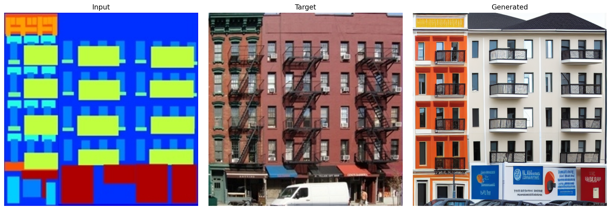

This repository provides a comprehensive pipeline for deploying a **ControlNet-enhanced Stable Diffusion model for generating building facades from semantic segmentation maps**. By integrating architectural structure into the image generation process, the model ensures spatial alignment and photorealistic outputs. This project builds on [lllyasviel/sd-controlnet-seg](https://huggingface.co/lllyasviel/sd-controlnet-seg) and adapts it for facade-specific applications.

The model is trained using the ControlNet framework introduced in [_Adding Conditional Control to Text-to-Image Diffusion Models_](https://arxiv.org/abs/2302.05543), with optimized hyperparameters and a cosine learning rate schedule for stable fine-tuning.

<br>

## 📂 Repository Structure

```bash
git clone https://huggingface.co/doguilmak/facade-controlnet-sd15
```

Folder contents:

```
facade-controlnet-sd15/
├── controlnet/                         # ControlNet weights
├── diffusion_pytorch_model-001.safetensors  # Core UNet weights
├── feature_extractor/                  # ControlNet vision encoder
├── model_index.json                    # Pipeline metadata & config
├── scheduler/                          # Scheduler configs (e.g. DDIM, PNDM)
├── text_encoder/                       # CLIP text encoder weights
├── tokenizer/                          # CLIP tokenizer files
├── unet/                               # U-Net denoiser architecture
└── vae/                                # VAE encoder & decoder

```

<br>

## 🛠️ Installation

```bash
git clone https://huggingface.co/doguilmak/facade-controlnet-sd15
pip install diffusers transformers accelerate safetensors datasets  # optional
```

_(Optional: use Conda)_

```bash
conda create -n controlnet-env python=3.8
conda activate controlnet-env
```

<br>

## 🚀 Usage Overview

### 1. Training (Fine-tuning ControlNet)

Training involves fine-tuning only the **ControlNet-specific parameters**, while keeping the core Stable Diffusion components (**text encoder, UNet, VAE**) frozen. This design allows the model to learn how to control image generation via semantic segmentation maps without disrupting the pretrained generative capacity of the base model.

#### 🧾 Training Details

- **Data**:  
  Each RGB image $x_0$ is paired with a segmentation map $c$. Both are resized to $512 \times 512$ and normalized to the $[-1, 1]$ range, using the following transformation:

  <p align="center">
      
  </p>

- **Model Setup**:  
  The pipeline is initialized using the `sd-controlnet-seg` checkpoint. All core components of Stable Diffusion (VAE, UNet, and text encoder) are frozen during training. Only the ControlNet layers are trainable.

- **Noise Schedule**:  
  A **linear β-schedule** is used with:

  <p align="center">
      
  </p>

- **Noise Modeling**:  
  The model predicts added noise $\epsilon$ in the diffusion process, defined as:

  <p align="center">
      
  </p>

- **Loss Function**:  
  The training loss is the **Mean Squared Error (MSE)** between the predicted and actual noise at each timestep:

  <p align="center">
      
  </p>

  where $\epsilon_\theta$ is the predicted noise, $\epsilon$ is the actual noise sampled from a standard normal distribution, and $\theta$ are the trainable parameters of ControlNet. The loss is normalized by the number of gradient accumulation steps.

- **Optimization**:  
  The model is optimized using the **AdamW optimizer** with a **learning rate of $3.38 \times 10^{-8}$**. Training was performed with a **batch size of 32** and **gradient accumulation over 8 steps**, which effectively simulates a larger batch size of 256. Gradient clipping was applied with a **maximum norm of 1.0** to stabilize training. The model was trained for **30 epochs** using **1,012 image-mask pairs**, completing in approximately 1 hours on an **NVIDIA A100 40GB GPU**.

- **Sampling Configuration during Evaluation**:
  - **NUM_STEPS**: 50  
    → Controls the number of denoising steps used during inference. More steps generally produce better quality.
  - **GUIDANCE**: 9.0  
    → Classifier-free guidance scale for balancing fidelity and diversity.

- **Final Loss**:  
  After 30 epochs of training, the final training loss reached $0.0178$.
  
-   **Checkpoints**: Saved every $10$ epochs to `output/checkpoints/`, and exported as `full_pipeline/` at completion.

<br>

### 2. Inference Example

```python
from diffusers import StableDiffusionControlNetPipeline, DPMSolverMultistepScheduler
from PIL import Image

pipeline = StableDiffusionControlNetPipeline.from_pretrained(
    "/facade-controlnet-sd15/full_pipeline",
    safety_checker=None,
    torch_dtype=torch.float32
)
pipeline.scheduler = DPMSolverMultistepScheduler.from_config(pipeline.scheduler.config)
pipeline.enable_xformers_memory_efficient_attention()
pipeline.to("cuda")

control = Image.open("path/to/seg_map.png").resize((512, 512)).convert("RGB")
output = pipeline(
    prompt="photorealistic facade, high detail, sunlight",
    negative_prompt="blurry, distorted, low resolution",
    image=control,
    control_image=control,
    num_inference_steps=50,
    guidance_scale=9,
    output_type="pil"
).images[0]

output.save("output/facade_result.png")

```

### 📄 **Usage Guide**  
To quickly get started with the model and see how it works in action, refer to the [**`Usage.ipynb`**](/usage/Usage.ipynb) notebook. This notebook provides an easy-to-follow walkthrough for using the trained model for segmentation-guided image generation. It covers everything from loading the model to performing inference and generating high-quality images based on input segmentation maps. You can easily run the notebook to see how the model performs and make adjustments as needed.

**Tips**:

-   Set `num_images_per_prompt > 1` for multi-sample outputs.
    
-   Override `height` and `width` for custom sizes.
    
-   Enable `pipeline.enable_attention_slicing()` to reduce VRAM usage.

<br>

## 📸 Sample Outputs

These examples illustrate the model’s ability to generate photorealistic urban scenes guided by semantic segmentation maps. The outputs demonstrate strong spatial alignment between the input masks and the synthesized content, capturing realistic facades.


<br>



## Limitations

-   Trained at $512 \times 512$ resolution — lower or higher resolutions may affect quality.
    
-   Performs best on **facade-style segmentation maps** with clear class distinctions.
    

## 📖 References

-   **ControlNet Segmentation Model**: [lllyasviel/sd-controlnet-seg @ Hugging Face](https://huggingface.co/lllyasviel/sd-controlnet-seg)
    
-   **ControlNet Paper**: Y. Zhao _et al._, “Adding Conditional Control to Text-to-Image Diffusion Models,” _arXiv preprint_ arXiv:2302.05543, 2023.

-   **Massachusetts Institute of Technology**: [Training a ControlNet for Stable Diffusion](6.8300.csail.mit.edu/sp23/projects/ControlNet_for_Stable_Diffusion.pdf)
    
-   **Facades Dataset**: [Kaggle: Facades Dataset](https://www.kaggle.com/datasets/balraj98/facades-dataset)
